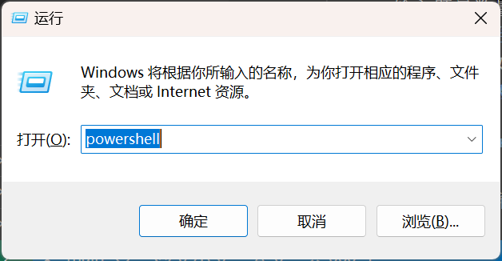
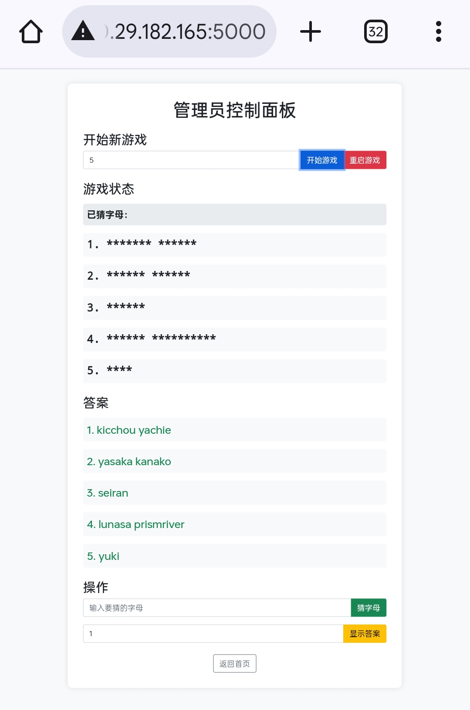

# 开字母游戏 - 管理员操作手册

## 一、准备工作

1. **环境配置**：
    - 解压资源包
    - 在资源目录打开终端，安装依赖：
      `pip install -r requirements.txt`
    - 启动服务器：`python app.py`
2. 确保游戏服务器已启动，确保设备与服务器在同一局域网（手机热点）内
3. 主机打开默认游客界面：`http://localhost:5000`
4. 管理员使用另一台设备（如手机）通过主机 IP 地址打开管理员界面：
    - `Win+R`打开运行，输入`powershell`或`cmd`打开终端
      
    - 在主机终端输入`ipconfig`，找到 IPv4 地址就是主机 IP
    - 在手机端浏览器`http://localhost:5000`
5. 参看[网络访问配置指南](#网络访问配置指南)第二条配置 Windows 防火墙

## 二、管理员登录

1. 点击"**管理员入口**"
2. 输入管理员密码（默认：**07210721**，如有必要在`app.py`的`admin()`函数中自行更改密码）
3. 进入管理员控制面板
   

## 三、游戏操作

1. **开始新游戏**

    - 输入题目数量（1-10）
    - 点击"**开始游戏**"按钮
    - 如需重新开始，点击"**重启游戏**"按钮 ~~_（其实两个都一样，_~~ _建议只按**开始游戏**按钮）_

2. **猜字母操作**

    - 在输入框中输入单个字母（如果游客提出其它字符也可以，不过题源不存在非英文字母字符）
    - 点击"**猜字母**"按钮
    - 系统会自动检查并揭示所有匹配的字母
    - 注意：**只能输入一个字母**，输入多个字母会收到提示

3. **显示答案**
    - 核对玩家猜的是否正确（对照管理员页面下方答案）
    - 输入要显示的**题目序号**
    - 点击"**显示答案**"按钮
    - 该题目会完全显示

## 四、最佳实践

1. 游戏开始前

    - 确认所有设备连接正常
    - 测试页面访问是否正常
    - 准备合适的题目数量（如 10-12 道题）

2. **游戏进行中**

    - **组织 3-5 名游客参与游戏，按顺序轮流开字母和猜角色**
    - **注意控制游戏节奏和每个玩家思考时长**
    - **及时回应玩家猜测**
    - **适时给予提示**
    - **记录各玩家猜出角色总数**

3. **游戏结束后**
    - **确认游戏状态**
    - **给予猜的最多的玩家小奖品**

## 五、注意事项

1. 网络设置

    - 确保服务器防火墙允许 5000 端口访问
    - 如需外网访问，需要配置端口转发
    - 建议使用固定 IP 或域名

2. 安全建议

    - 定期更改管理员密码
    - 不要将密码告知他人
    - 游戏结束后及时关闭服务器

3. 故障处理
    - 如遇页面无法访问，检查服务器状态
    - 如遇游戏异常，可以重启游戏
    - 如遇严重问题，可以重启服务器

## 网络访问配置指南

1. **获取服务器 IP 地址**

    - Windows 系统：
        1. `Win+R`打开运行，输入`powershell`或`cmd`打开终端
        2. 输入命令：ipconfig
        3. 找到"IPv4 地址"，例如：192.168.1.100

2. **配置防火墙**

    - Windows 系统：
        1. 打开 Windows Defender 防火墙
        2. 点击"高级设置"
        3. 选择"入站规则" -> "新建规则"
        4. 选择"端口" -> "TCP" -> 输入"5000"
        5. 选择"允许连接" -> 选择适用的网络类型
        6. 输入规则名称（如"Flask Web Server"）

3. **访问方式**

    - 其他设备在浏览器中输入：http://[服务器 IP]:5000
    - 例如：`http://192.168.1.100:5000`

4. **故障排除**
    - 如果无法访问，检查：
        1. 服务器 IP 地址是否正确
        2. 防火墙设置是否正确
        3. 所有设备是否在同一局域网
        4. 服务器是否正在运行
